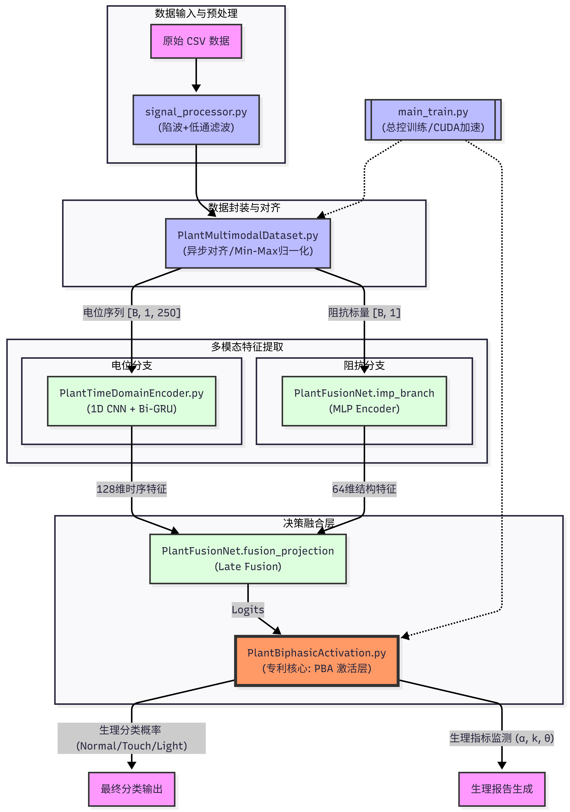
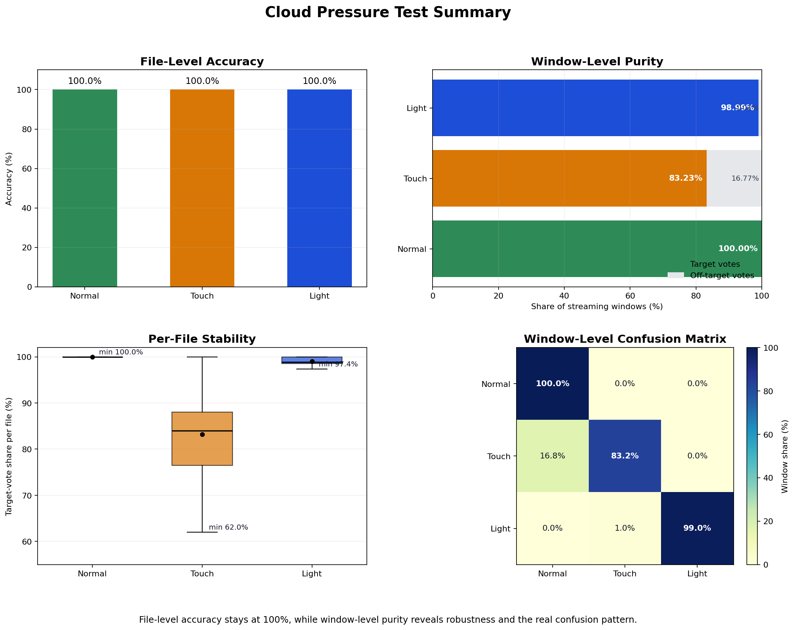
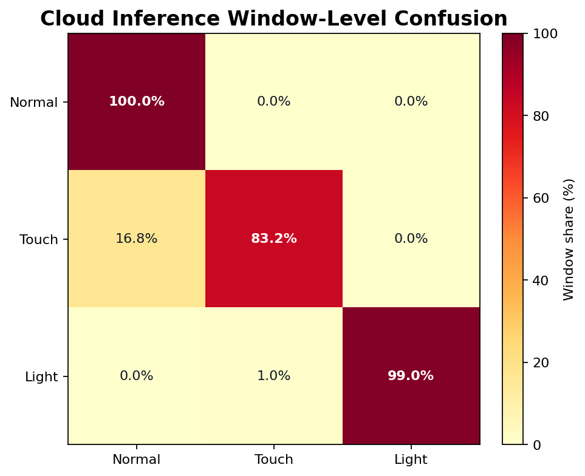

# Plant Condition Model

基于植物电位时序和单点阻抗的多模态状态识别项目。当前仓库已经整理为可直接训练、测试和部署的交付版本，正式保留的最终类别为 `light / normal / touch`；早期 `stress` 原型、重复数据、旧权重、生成脚本和本地环境均已归档到 `intermedia_res/`，并通过 `.gitignore` 排除提交。

## 项目完成情况

- 最终可部署模型权重: `model/plant_fusion_best.pt`
- 训练数据:
  - `dataset_real_condition/`: 原始合并 CSV
  - `dataset_real_condition_filtered_v2/`: 过滤后的训练数据
- 测试数据:
  - `analysis_outputs/local_smoke/`: 3 个本地 smoke case
  - `dataset_raw_test_fullfix_filtered/`: 长序列压测集
- 测试结论与图表: `analysis_outputs/`

## 推理原理

模型输入来自植物的电压时序信号与阻抗信号。电压分支负责提取瞬时脉冲和长时漂移特征，阻抗分支负责表征长时刺激带来的生理属性变化。两路特征在融合层中完成门控聚合，再经双相激活层输出类别概率，并给出该窗口更偏向快相响应还是慢相响应的生理指示。

当前实现对应的主干结构是:

- 电位分支: 多尺度 1D CNN + Bi-GRU
- 阻抗分支: MLP 编码
- 融合层: 阻抗引导的门控融合
- 输出层: Biphasic Activation，输出类别概率与 `fast_response / slow_response`

## 架构图



## 压测结果图





压测摘要来自 `analysis_outputs/pressure_summary.json`:

- 文件级准确率: `Normal 100% / Touch 100% / Light 100%`
- 窗口级纯度: `Normal 100.00% / Touch 83.23% / Light 98.99%`
- 主要混淆:
  - `Touch -> Normal`: `16.77%`
  - `Light -> Touch`: `1.01%`

## 目录说明

```text
.
├── PlantTimeDomainEncoder.py
├── PlantFusionNet.py
├── PlantBiphasicActivation.py
├── PlantMultimodalDataset.py
├── inference_utils.py
├── signal_processor.py
├── main_train.py
├── test.py
├── test_res.py
├── deploy_api.py
├── model/
│   └── plant_fusion_best.pt
├── dataset_real_condition/
├── dataset_real_condition_filtered_v2/
├── dataset_raw_test_fullfix_filtered/
├── analysis_outputs/
└── intermedia_res/  # 已归档、默认不提交
```

## 数据格式

训练和推理默认读取按类别分目录的 CSV:

```text
dataset_root/
├── light/
├── normal/
└── touch/
```

CSV 至少需要包含:

- 电压列: `电压` 或 `电压(V)`
- 阻抗列: `阻抗` 或 `幅值`
- 可选时间列: `时间(s)`，用于估算采样率和滤波参数

窗口配置:

- `window_size = 250`
- `train_stride = 50`
- `stream_stride = 50`

## 环境安装

```bash
python -m venv .venv
source .venv/bin/activate
pip install -r requirements.txt
```

## 如何训练

### 1. 原始数据预处理

从原始采集数据重新清洗一版训练集，先运行:

```bash
python signal_processor.py \
  --input dataset_real_condition \
  --output dataset_real_condition_filtered \
  --summary-json analysis_outputs/preprocessing_summary.json
```

该步骤会:

- 对电压信号做低通滤波
- 在可用时自动判断是否需要工频陷波
- 对每个文件内的电压做标准化
- 生成预处理参数摘要 JSON

### 2. 训练模型

```bash
python main_train.py \
  --data-root dataset_real_condition_filtered \
  --output model/plant_fusion_best.pt
```

常用可选参数:

- `--epochs 20`
- `--batch-size 32`
- `--lr 3e-4`
- `--window-size 250`
- `--stride 50`

训练会同时保存:

- 最佳模型: `model/plant_fusion_best.pt`
- 最后一轮模型: `model/plant_fusion_best_last.pt`

## 如何测试

### 1. 单文件推理

默认 smoke case:

```bash
python test.py --csv analysis_outputs/local_smoke/raw_test_touch_000.csv 
```

输出内容包括:

- 文件级主导类别
- 滑窗数量
- 投票分布
- 平均类别概率
- 代表性窗口的快慢相指标

如果需要完整窗口明细:

```bash
python test.py \
  --csv analysis_outputs/local_smoke/raw_test_touch_000.csv \
  --include-windows
```

### 2. 批量压测

本地模型模式:

```bash
INFERENCE_MODE=local \
EXPECTED_TYPE=TOUCH \
TARGET_DIR=dataset_raw_test_fullfix_filtered/touch \
python test_res.py
```

如果你已经起了 HTTP 服务，也可以切换到接口模式:

```bash
INFERENCE_MODE=cloud \
EXPECTED_TYPE=TOUCH \
TARGET_DIR=dataset_raw_test_fullfix_filtered/touch \
API_URL=http://127.0.0.1:8000/predict \
HEALTH_URL=http://127.0.0.1:8000/health \
python test_res.py
```

## 如何部署

### 1. 启动服务

```bash
python deploy_api.py --host 0.0.0.0 --port 8000
```

服务提供两个接口:

- `GET /health`
- `POST /predict`

### 2. 健康检查

```bash
curl http://127.0.0.1:8000/health
```

### 3. 推理请求格式

`POST /predict` 请求体:

```json
{
  "voltage": [250 个电压采样点],
  "impedance": 7123.4
}
```

返回字段包括:

- `label`
- `confidence`
- `probabilities`
- `fast_response`
- `slow_response`
