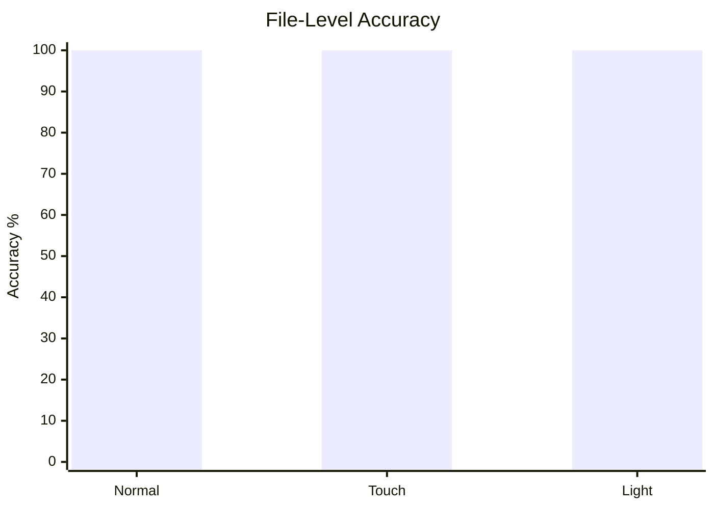
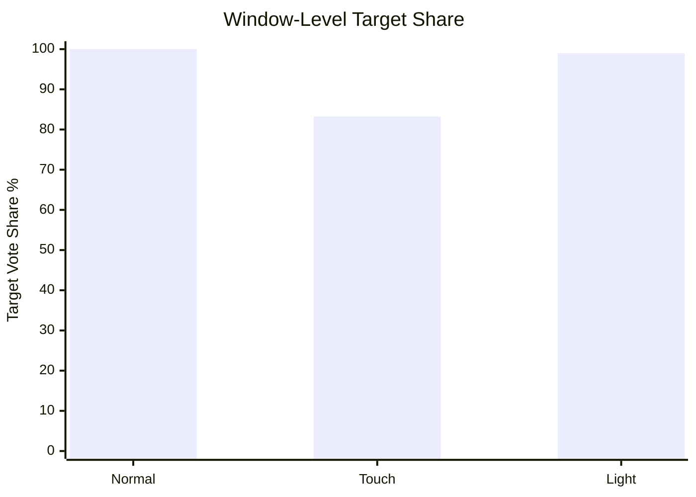
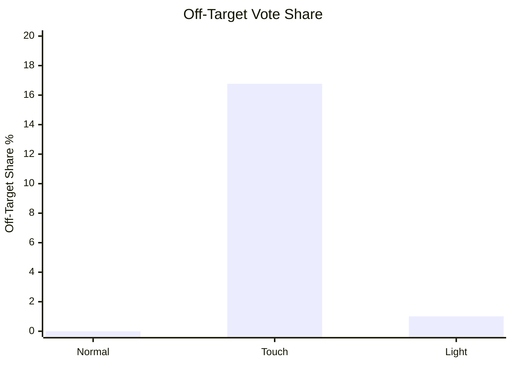

# Cloud Pressure Test Report

## Core Takeaways

- File-level accuracy is `100%` for all three classes under cloud pressure testing.
- Window-level purity shows the real robustness gap:
  - `NORMAL`: `100.00%`
  - `LIGHT`: `98.99%`
  - `TOUCH`: `83.23%`
- The confusion is structured rather than random:
  - `LIGHT` only leaks slightly into `TOUCH` (`1.01%`), not into `NORMAL`.
  - `TOUCH` mainly leaks into `NORMAL` (`16.77%`), which matches the physiological adjacency of low-amplitude stable segments.
  - `NORMAL` has zero leakage.

## Precision Stats

| Class | Files | File Accuracy | Window Votes | Target Votes | Target Share | Off-target Votes | Main Confuser |
| --- | ---: | ---: | ---: | ---: | ---: | ---: | --- |
| NORMAL | 50 | 100.00% | 8407 | 8407 | 100.00% | 0 | None |
| TOUCH | 50 | 100.00% | 2499 | 2080 | 83.23% | 419 | NORMAL |
| LIGHT | 50 | 100.00% | 13331 | 13197 | 98.99% | 134 | TOUCH |

## Stability Stats

| Class | Mean Target Share / File | Min Target Share / File | Mean Margin / File | Min Margin / File |
| --- | ---: | ---: | ---: | ---: |
| NORMAL | 100.00% | 100.00% | 100.00% | 100.00% |
| TOUCH | 83.23% | 62.00% | 66.46% | 24.00% |
| LIGHT | 98.99% | 97.37% | 97.99% | 94.74% |

## Recommended Narrative

Do not lead with only `100% accuracy`, because that hides how hard the streaming task really is.

Lead with three points:

1. The model remains correct at the **file decision level** for all classes under sliding-window cloud inference.
2. `NORMAL` and `LIGHT` are not only correct, but also **high-purity and high-stability** classes.
3. `TOUCH` is the hardest class, yet the model still keeps **100% file-level decision accuracy**, and its confusion is concentrated only against `NORMAL`, not spread randomly.

That framing is much stronger than a plain accuracy claim, because it shows:

- robustness under pressure
- stability over time
- interpretable confusion structure

## Mermaid Code

### 1. File-Level Accuracy

### 2. Window-Level Purity

### 3. Off-Target Pressure

## Suggested Figures To Send

- `pressure_dashboard.png`
  Best single-slide summary. Suitable for direct reporting.
- `pressure_confusion_heatmap.png`
  Best figure if you want to explain where confusion happens.
- `pressure_dashboard.svg`
  Vector version for docs or PPT.
